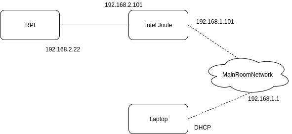

# MarcoPolo

## Network Overview

An overview of the IP addresses are as follows.  Note that the Raspberry PI also has a connection to PSU Secure for performing cloud API calls.



Note, the ROS Master is runing on `http://192.168.1.101:11311`.  The Joule is also running with ipv4 forwarding active.  Therefore in order to actually communicate with the Raspberry PI wirelessly via the MainRoom Network, the client laptop must set up a static route.  This tells the client that it can get to tht 192.168.2.XXX subnet via 192.168.1.101 (aka the Joule).

``` bash
sudo ip route add 192.168.2.0/24 via 192.168.1.101
```

## Future Improvements

Configure system to roslaunch on the remote RPI from the Joule.  This will save a step.